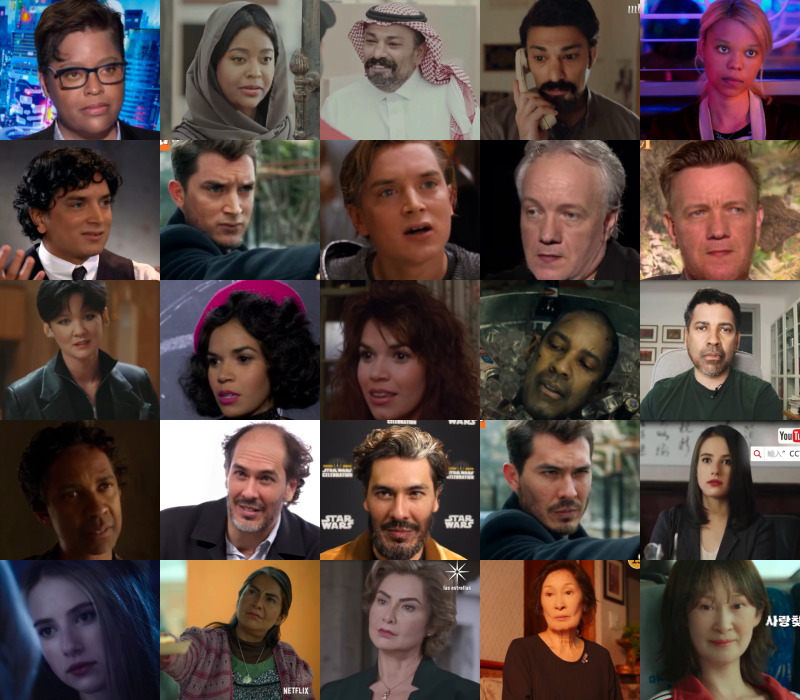

# 🎭 Fake_for_all



## 📁 Dataset Summary

- **188,487 synthetic videos**
- **22,067 real videos**
- Balanced across:
  - **5 ethnic groups**: Afrodescendant, Asian, Caucasian, Latino, Middle Eastern–North African
  - **2 genders**

See pipeline diagram below:


---

## ⚙️ Setup

### ✅ Requirements

- Python 3.8+
- [Conda](https://docs.conda.io/en/latest/miniconda.html) (optional but recommended)

### 🔧 Install Dependencies

```bash
pip install -r requirements.txt
```

---

## 🚀 Step-by-Step Pipeline

### 1️⃣ Download YouTube Videos

```bash
python video_downloader.py
```

---

### 2️⃣ Segment Faces from Videos

```bash
python video_segment_extractor.py --input /path/to/videos --output /path/to/output
```

---

### 3️⃣ Extract Best Face per Video

#### a. Clone Face Extractor Repo

```bash
git clone https://github.com/freearhey/face-extractor.git
cd face-extractor
```

#### b. Copy `face_selector.py` to Repo

```bash
cp /path/to/face_selector.py .
```

#### c. Install Requirements

```bash
pip install -r requirements.txt
```

#### d. Run Face Selector

```bash
python face_selector.py --source /path/to/videos --target /path/to/faces --temp /tmp/faces
```

> Selects and saves **the best face** per video using BRISQUE score and landmarks.

---

### 4️⃣ Upscale Faces (Optional)

Using [Real-ESRGAN](https://github.com/xinntao/Real-ESRGAN):

#### a. Clone & Setup

```bash
git clone https://github.com/xinntao/Real-ESRGAN.git
cd Real-ESRGAN
pip install -r requirements.txt
python setup.py develop
```

#### b. Copy Script

```bash
cp /path/to/upscale_frames.py .
```

#### c. Run Upscaler

```bash
python upscale_frames.py --input /path/to/faces --output /path/to/output --gpus 0
```

---

### 5️⃣ Predict Gender from Video Segments

```bash
python video_gender_classifier.py --input /path/to/segments --output /path/to/output --result_csv gender_results.csv
```

---

### 6️⃣ Generate Synthetic Videos with Roop

```bash
python roop_generator.py \
  --gpu 0 \
  --source_path /path/to/faces \
  --videos_path /path/to/videos \
  --output_path /path/to/output
```

> Uses each face image to generate a deepfake on each target video.

> **Note:** Before running, edit the `get_temp_directory_path` function in `roop/roop/utilities.py` to replace the `/path/to/data` path with the folder you want to use for storing temporary files.
---

### 7️⃣ Extract Metadata

```bash
python media_metadata_extractor.py --root /path/to/output --output metadata.json.gz
```
